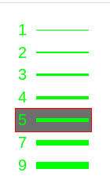

# react-line-width-picker

> A line width picker React component

[](https://www.npmjs.com/package/react-line-width-picker) [](https://standardjs.com)

Basically the same as [[react-line-width-chooser](https://github.com/okloecker/react-line-width-chooser)], but as an importable React component created with [[create-react-library](https://www.npmjs.com/package/create-react-library)].

## Install

```bash
npm install --save react-line-width-picker
```

## Intro

<p align="center">
  
</p>

## Usage

```jsx
import React, { Component } from 'react'

import LineWidthPicker from 'react-line-width-picker'
import 'react-line-width-picker/dist/index.css'

class Example extends Component {
  render() {
    return <LineWidthPicker />
  }
}
```

### LineWidthPicker accepts these props:
 * lineWidths: array of widths to display (default: [1, 2, 3, 4, 5, 7, 9])
 * lineWidth: the default selected element from lineWidths
 * width: component width (default: 100)
 * background: component's background colour (default: "#000000");
 * colour: the texts' and lines' colour (default: "#00ff00")
 * hoverBorder: an element's border when hovering over it (default: no border)
 * hoverBackground: an element's background when hovering over it (default: undefined)
 * font: the text's font-family (default: "sans-serif")
 * fontSize: the text's font size (CSS value; default: initial)
 * opacity: the component's opacity (not the hovering opacity; CSS value, default: 1)
 * onClick: a function that is called with a single argument, the line width value from lineWidths, when user clicks a hovered line
 * onChange: a function that is called with the hovered over lineWidth when user hovers over a line (enters it)

## License

MIT © [okloecker](https://github.com/okloecker)
